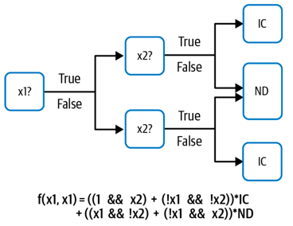
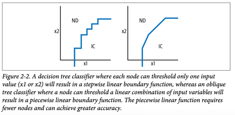

# Data representation design patterns

* | machine learning model's heart
  * 💡== mathematical function / -- defined to operate on -- SPECIFIC types of data 💡
* real-world machine learning models
  * 👀-- need to operate on -- data / -- MAY NOT be directly pluggable into the -- mathematical function 👀
* 💡data representation
  * := input data / 's form != expected by the model (== boolean) -> can be used -- as -- input 💡
    * _Example:_ decision tree-decision tree machine learning software's mathematical core
      * -- operates on -- boolean variables 
      * == 
        * functions / from data -> learn an optimal tree +
        * about DIFFERENT types of numeric and categorical data, ways to
          * read in
          * process
      * use case
        * decision tree / 
          * predict whether a baby -- will require --
            * intensive care (IC) or
            * normally discharged (ND),
          * 2 inputs (== variables): x1 & x2
            * ⚠️BOTH MUST be boolean ⚠️ 
              * Reason: 🧠make f(x1, x2) to work 🧠
              * hospital 
                * ❌| baby was born, is NOT valid ❌
                  * Reason: 🧠NOT boolean 🧠
                * | operation -- is -- performed / is boolean, is valid 
                  * _Example:_ x1 = (hospital IN France)
              * baby’s weight
                * ❌NOT valid❌
                  * Reason: 🧠NOT boolean 🧠
                * | operation -- is -- performed / is boolean, is valid
                  * _Example:_ x2 = (babyweight < 3 kg)
    
        
* | this book
  * input's meaning 
    * == real-world data / feed the model
      * _Example:_ baby weight
  * feature
    * == transformed data / model actually operates on
      * _Example:_ whether babyweight < 3 kg
  * feature engineering
    * == process of creating features
    * == way of selecting the data representation
* 💡learnable data representations
  * := data representations / learning model learns how to create EACH decision tree's node 💡
    * _Example of machine learning models:_ decision trees
    * _Example:_ | PREVIOUS example
      * | data representation,
        * HARDCODED threshold of 3kg
      * | learnable data representation,
        * threshold y adjusted by ML model
    * == AUTOMATICALLY engineered features
* Embeddings design pattern
  * == learnable data representation / 
    * use deep neural networks
    * learned representation
      * dense
      * 's dimension < input's dimension
    * learning algorithm
      * from the input -- extracts the -- MOST salient information
      * represent MOST salient information -- via -- MORE concise way | feature 
* "feature extraction"
  * == learning features
* decision tree
  * use case
    * EACH node -- represent -- ONLY 1! input variable
      * == stepwise linear function
* oblique decision tree
  * == sophisticated version of traditional decision trees
  * type
    * of 1! input variable 
      * _Example:_ >=2 input variables -- are linear combined & threshold, to create -- 1 boolean feature
  * use case
    * EACH node -- represent a -- linear combination of input variables
      * == piecewise linear function 
        * greater accuracy
        * FEWER nodes 
        * SIMPLER
        * FASTER to learn
  
  
* Feature Cross design pattern
  * An extension of this idea 
  * -- simplifies the -- learning of AND relationships BETWEEN multivalued categorical variables

* Hashed Feature design pattern
  * deterministic / model does NOT require to know ALL particular input's potential values 
  * recommendations
    * use Multimodal input 
    
## Simple data representations
* TODO:

## Design pattern 1: Hashed Feature
* TODO:

## Design pattern 2: Embeddings
* TODO:

## Design pattern 3: Feature Cross
* TODO:

## Design pattern 4: Multimodal Input
* TODO: